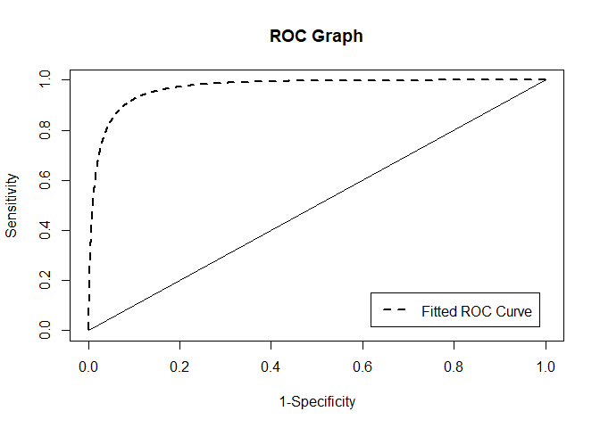

<!-- README.md is generated from README.Rmd. Please edit that file -->

# PLindleyROC

<!-- badges: start -->
<!-- badges: end -->

The goal of PLindleyROC is to evaluate the Receiver Operating
Characteristic (ROC) for Power Lindley Distribution. Additionally, The
performace asssesments can be performed associated with the Bi-Power
Lindley ROC model.

## Installation

You can install the development version of PLindleyROC from
\[GitHub\]\[<https://github.com/ErtanSU/PLindleyROC>\] with:

``` r
# install.packages("devtools")
devtools::install_github("ErtanSU/PLindleyROC")
```

## Example

This is a basic example which shows you how to solve a common problem:

``` r
library(PLindleyROC)
dPLD(c(1,2,3,4,5,200),alpha=3,beta=2)
#> [1]  1.082682e+00  1.620507e-05  3.560890e-21  1.070039e-52 3.363180e-105
#> [6]  0.000000e+00
```

``` r
library(PLindleyROC)
pPLD(c(.5,1,2,3,4),alpha=3,beta=2)
#> [1] 0.1562992 0.7744412 0.9999993 1.0000000 1.0000000
```

``` r
library(PLindleyROC)
qPLD(c(.9971,0.5,0.3),alpha=3,beta=2)
#> [1] 1.5220612 0.7868721 0.6362570
```

``` r
library(PLindleyROC)
rPLD(10,alpha=3,beta=2)
#>  [1] 1.2006110 0.8088569 0.5804879 0.6932256 0.9997314 0.6584055 0.8620276
#>  [8] 1.1146282 0.7917246 0.8478548
```

``` r
library(PLindleyROC)
plAUC(alpha1=2,beta1=5,alpha2=6,beta2=1)
#> [1] 0.9688111
```

``` r
library(PLindleyROC)
plJ(alpha1=2,beta1=5,alpha2=6,beta2=1,init=0)
#> $par
#> [1] 0.7345928
#> 
#> $value
#> [1] -0.8241212
#> 
#> $counts
#> function gradient 
#>       16       16 
#> 
#> $convergence
#> [1] 0
#> 
#> $message
#> [1] "CONVERGENCE: REL_REDUCTION_OF_F <= FACTR*EPSMCH"
```

``` r
library(PLindleyROC)
plER(alpha1=2,beta1=5,alpha2=6,beta2=1,init=0)
#> $par
#> [1] 0.7430008
#> 
#> $value
#> [1] 0.1247003
#> 
#> $counts
#> function gradient 
#>       11       11 
#> 
#> $convergence
#> [1] 0
#> 
#> $message
#> [1] "CONVERGENCE: REL_REDUCTION_OF_F <= FACTR*EPSMCH"
```

``` r
library(PLindleyROC)
plCZ(alpha1=2,beta1=5,alpha2=6,beta2=1,init=0)
#> $par
#> [1] 0.736217
#> 
#> $value
#> [1] -0.831771
#> 
#> $counts
#> function gradient 
#>       17       17 
#> 
#> $convergence
#> [1] 0
#> 
#> $message
#> [1] "CONVERGENCE: REL_REDUCTION_OF_F <= FACTR*EPSMCH"
```

``` r
library(PLindleyROC)
plIU(alpha1=2,beta1=5,alpha2=6,beta2=1,init=0)
#> $par
#> [1] 0.7345927
#> 
#> $value
#> [1] 0.113501
#> 
#> $counts
#> function gradient 
#>       12       12 
#> 
#> $convergence
#> [1] 0
#> 
#> $message
#> [1] "CONVERGENCE: REL_REDUCTION_OF_F <= FACTR*EPSMCH"
```

``` r
library(PLindleyROC)
plNI(alpha1=2,beta1=5,alpha2=6,beta2=1,init=0)
#> $par
#> [1] 0
#> 
#> $value
#> [1] 0
#> 
#> $counts
#> function gradient 
#>        1        1 
#> 
#> $convergence
#> [1] 0
#> 
#> $message
#> [1] "CONVERGENCE: NORM OF PROJECTED GRADIENT <= PGTOL"
```



``` r
library(PLindleyROC)
prfROC(ctp=0.5,alpha1=2,beta1=5,alpha2=6,beta2=1)
#>  Sensitivitiy   Specificity 1-Specificity 
#>     0.9921878     0.6538067     0.3461933
```

What is special about using `README.Rmd` instead of just `README.md`?
You can include R chunks like so:

``` r
summary(cars)
#>      speed           dist       
#>  Min.   : 4.0   Min.   :  2.00  
#>  1st Qu.:12.0   1st Qu.: 26.00  
#>  Median :15.0   Median : 36.00  
#>  Mean   :15.4   Mean   : 42.98  
#>  3rd Qu.:19.0   3rd Qu.: 56.00  
#>  Max.   :25.0   Max.   :120.00
```

You’ll still need to render `README.Rmd` regularly, to keep `README.md`
up-to-date. `devtools::build_readme()` is handy for this.

You can also embed plots, for example:

In that case, don’t forget to commit and push the resulting figure
files, so they display on GitHub and CRAN.
